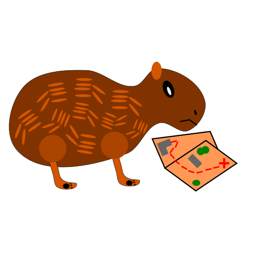

# Capybara Campus Crawl

The main monorepo for the Mizzou CS Senior Capstone project.

# About
A web application to find buildings and routes on Mizzou campus

# DEMO url
http://capybara-dev.eastus.cloudapp.azure.com:4200/

# Team
- Michael Navazhylau: Backend, Swagger, Docker CI/CD
- Isaac Milarsky: Raspberry PI Crowd Metrics collection
- Olivia LaVal: Frontend
- Robert Graman: Backend Routing
- Daniel Marin: Backend
- Alex Centorbi: Frontend

# Instructions
Instructions on how to run the dev docker containers can be found [here](instructions.md)
